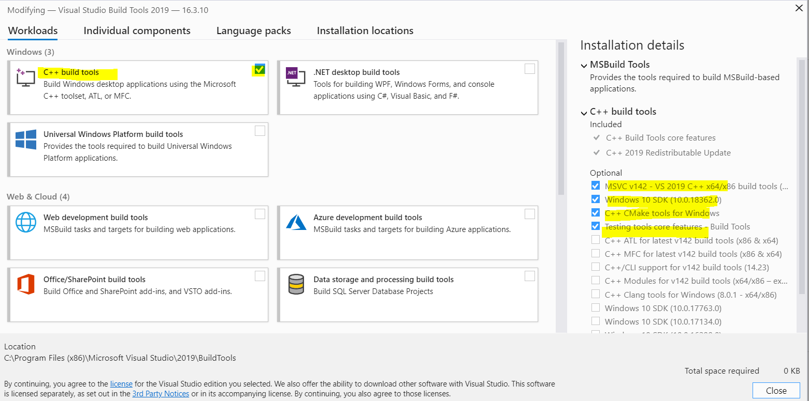

## Pour compiler le projet

1.  Vous pouvez commencer par installer [Rust](https://www.rust-lang.org/tools/install) si ce n'est pas déjà fait.

    *   Si vous êtes sur windows, on vous conseille d'utiliser [Microsoft Visual C++](https://visualstudio.microsoft.com/fr/visual-cpp-build-tools/) :
        1. Si vous choisissez d'utiliser `MSVC`, il faudra alors choisir `C++ build tool` puis sélectionner les composants suivants (environ 3 - 4 Go) :
             *   MSVC v142 - VS 2019 C++ x64/x86 build tools (...)
             *   Windows 10 SDK (10.0.18362.0)
             *   C++ CMake tools for Windows
             *   Testing tools core features
  
            
  

        2. Sinon, si vous préférez `GNU` Vous pouvez toujours utilisez `Mingw`, mais à vos propres risques. Voici un [lien](https://stackoverflow.com/questions/47379214/step-by-step-instruction-to-install-rust-and-cargo-for-mingw-with-msys2) pouvant vous aider (Je n'ai personellement pas réussi).
       *   Sinon, si vous êtes sur Linux ou Mac, je n'ai personnellement aucune expérience, et je vous invite donc à suivre méticuleusement les étapes décrites sur la [page officielle](https://www.rust-lang.org/tools/install).

2. Ainsi, vous pourrez compiler le projet. Pour cela :
   *    Allez dans le dossier du projet Rust (celui qui contient src / cargo.toml / etc...)
        *    `$ cd res_projet`
   *    Compilez le projet en version finale avec Cargo :
        *    `$ cargo build`
   *    Vous pourrez alors run le binaire via :
        *    `$ cargo run test.txt`
             * (on peut noter que run lance aussi un appel à build, donc en soit, on aurait juste pu le faire directement. Mais c'est préférable de bien distinguer les erreurs de compilations (linker / etc...) des erreurs d'éxécutions (surtout après une nouvelle installation))

## Pour nettoyer vos fichier

*    N'oubliez pas de faire un clean car les fichiers temporaires des librairies prennent assez de place :
     *    `$ cargo clean`